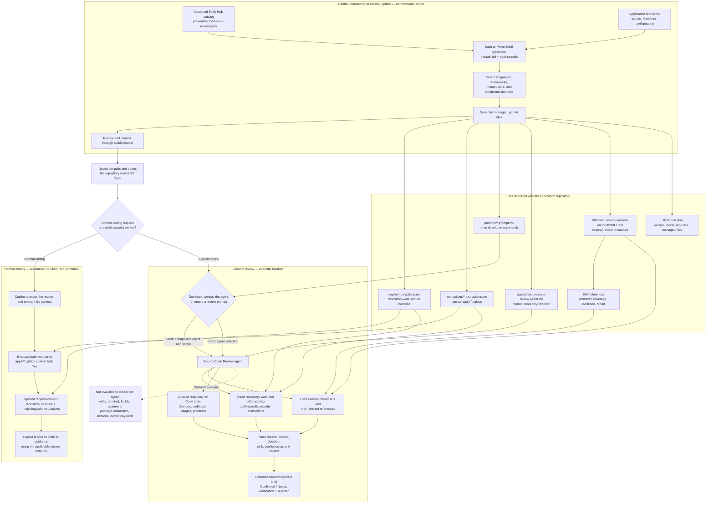

# GitHub Copilot activation flow

This diagram separates central repository onboarding from developer-time Copilot behavior. Technology selection is deterministic during generation; instruction applicability is automatic during a supported Copilot request; the deeper source-code review workflow remains explicitly developer-invoked.

## Activation rules

| Surface | When it is used | What it supplies or calls |
|---|---|---|
| Repository-wide instruction | Automatically for supported Copilot requests in the repository | Compact secure-development baseline |
| Path-specific instruction | Automatically when its `applyTo` glob matches a file involved in the task | Language, framework, infrastructure, domain, or cross-cutting controls |
| Prompt | Only when a developer enters its slash command | Scope and task text; selects the **Secure Code Review** agent |
| Secure Code Review agent | Only when selected directly or by one of the review prompts | Read-only operating boundary, evidence standard, instructions, skill, and allowed tools |
| Secure-code-review skill | Internally when the review agent follows its linked method | Workflow, review coverage, evidence validation, and report format |
| Skill reference | Progressively, when relevant to the active review | Detailed method guidance without loading every reference into every request |
| Read-only VS Code tools | At the review agent's discretion within the selected scope | Current changes, code search, usage search, and existing problems |

## Important boundaries

- The central Skills Hub repository is not automatically visible to Copilot in every application. Generated customization files must be delivered into each application repository, normally by central automation and a pull request.
- Automatic stack detection happens when the generator runs. If a repository later adds a technology, rerun the generator so its module becomes available.
- At request time, Copilot uses the generated repository-wide instruction and applicable path modules. Developers do not choose the technology manually.
- Prompts are entry points, not passive policy. They invoke the read-only agent only when a developer asks for a deeper review.
- The internal review skill is not a developer command and is not used during ordinary coding. The review agent follows it explicitly.
- Instructions influence Copilot behavior; they do not replace branch protection, human review, SAST, SCA, secret scanning, security tests, or runtime controls.

For the developer workflow, see the [quickstart](../QUICKSTART.md). For deployment and updates, see the [adoption guide](ADOPTION.md).
